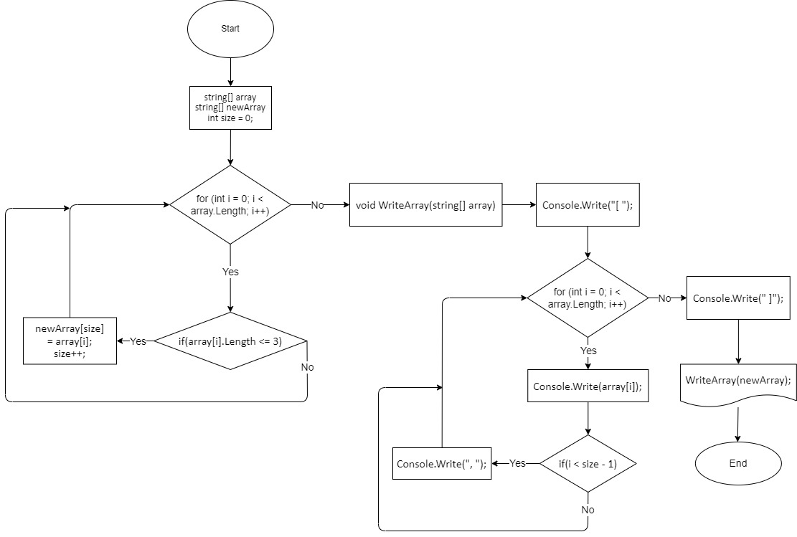

# **Контрольная работа**
## Задача:
>*Написать программу, которая из имеющегося массива строк формирует новый массив из строк, длина которых меньше, либо равна 3 символам. Первоначальный массив можно ввести с клавиатуры, либо задать на старте выполнения алгоритма. При решении не рекомендуется пользоваться коллекциями, лучше обойтись исключительно массивами.*

## Описание решение:

1. Объявляем первый массив с текстом, содержащий группу строк разной длинны.
2. Объявляем второй массив, присваивающий длину первого, а также добавляем переменную size = 0.
3. Цикл for где проверяем условие if - если длина элемента массива (array[i].Length) <= 3, то второй массив присвоит себе текущий size елемент из первого, а также счётчик size увеличивается на 1.
4. Метод WriteArray для вывода результата формирования массива. Внутри данного метода обозначаем начало его границы ( [ ). Затем с помощью цикла for по очереди выводим элементы данного массива с простановкой запятых через условие if - если переменная i < size - 1, то пишем запятую. После завершения цикла обозначаем конец границы ( ] ) массива.
5. Вызываем метод WriteArray где указываем второй массив с ране полученными элементами.